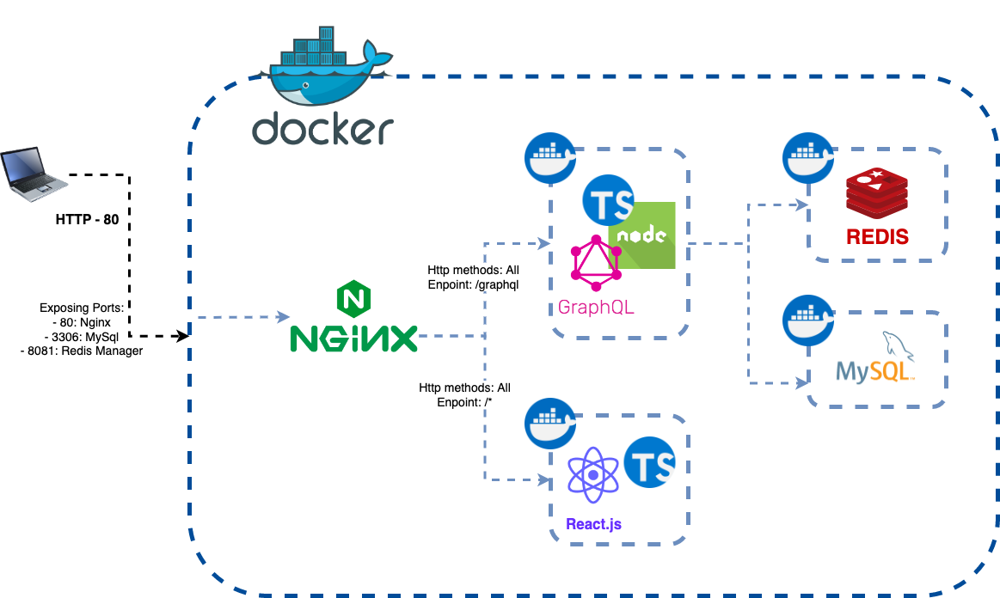
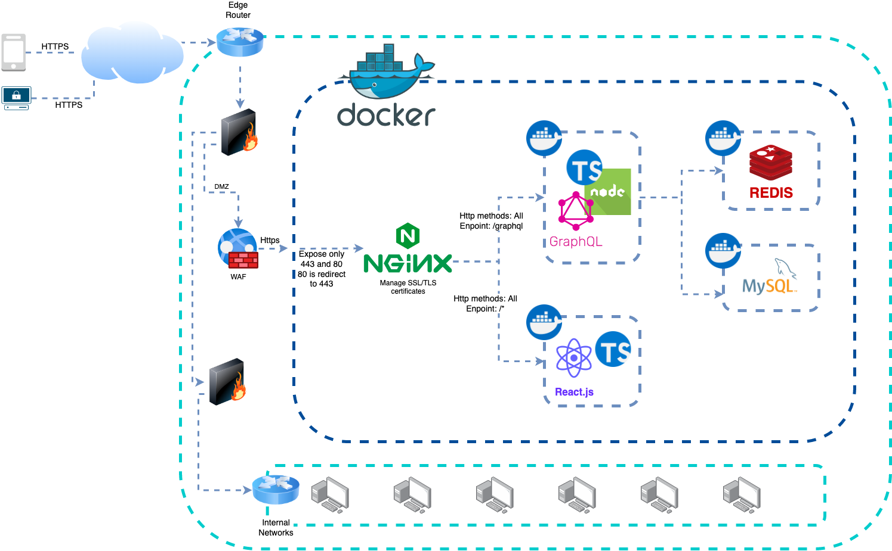

# Sistema de autenticación - segunda entrega Seguridad

Integrantes: Ignacio Barreto, German Rios, Sebastian Olivera, Patricio Zarauz

## Demo

https://user-images.githubusercontent.com/39178332/176276216-207c0cac-0634-4668-b612-c7f6b2695144.mov

## Requisitos

### Development environment

- [Docker >= 20.10.14](https://docs.docker.com/get-docker/)
- [Docker compose >= 1.29.2](https://docs.docker.com/compose/install/)
- [Node.js >= v16.15.1](https://nodejs.org/en/download/)

## Arquitecturas

### Development



### Production



## Levantar ambiente local para usar el proyecto

Primero se necesitan configurar las variables de entorno para su amibiente local, para esto hay que generar un `.env` en el directorio raíz del proyecto y como ejemplo de las variables necesarias encontrara en la misma ruta un archivo `.env.example` que tiene ejemplos para validar el formato que debería tener cada una de las variables.

Una vez configuradas las variables y cumpliendo con los requisitos de `docker` y `docker-compose`, para levantar y bajar el proyecto solo es necesario ejecutar los siguientes comandos

```bash
# levantar todos los servicios necesarios
docker-compose up -d

# bajar todos los servicios
docker-compose down

# bajar los servicios necesarios y borrar los datos de la base y redis
docker-compose down -v

# para ver que servicios se levantaron
docker ps

# con el siguiente comando puede ver los logs de cada uno de los servicios, si se agrega la opción -f se queda mostrando continuadamente los últimos logs
docker logs [options] <container_name>
```

Ahora en `http://localhost/graphql` puede acceder a la documentación y un dashboard de interacción con la api y en `http://localhost` puede acceder al dashboard principal.

**Solo para propósitos de desarrollo y test**, para comenzar a utilizar el sistema, interactuar y poder integrarse rápidamente al desarrollo, mediante migraciones, se han creado en la base de datos tres usuarios con tres niveles de privilegio diferentes, las siguientes son las credenciales de acceso para cada uno de los usuarios iniciales:

```bash
# usuario con rol administrador
usuario=admin
password=s3gur1d4dAdmin

# usuario con rol bibliotecario
usuario=funcionario1
password=s3gur1d4dFuncionario1

# usuario con rol normal
usuario=usuario1
password=s3gur1d4dUsuario1
```

## Levantar un ambiente estilo producción

Dependiendo la magnitud del proyecto, seguramente se requiera pasar los servicios de el docker-compose a deploys de `k8s` pero las consideraciones dentro del cluster serian las mismas, para probar un ambiente similar al productivo se sigue el mismo flujo que para el ambiente de dev pero el `docker-compose` a utilizar es el `docker-compose.production.yml`, para esto a los comandos de docker-compose hay agregar el flag `-f docker-compose.yml` por lo tanto los comandos quedarían

```bash
# levantar todos los servicios necesarios
docker-compose -f docker-compose.production.yml up -d

# bajar todos los servicios
docker-compose  -f docker-compose.production.yml down

# bajar los servicios necesarios y borrar los datos de la base y redis
docker-compose  -f docker-compose.production.yml down -v

# para ver que servicios se levantaron
docker ps

# con el siguiente comando puede ver los logs de cada uno de los servicios, si se agrega la opción -f se queda mostrando continuadamente los últimos logs
docker logs [options] <container_name>
```

Los cambios entre orquestar con `docker-compose.yml` y `docker-compose.production.yml` que mejoran la seguridad son los siguientes:

- Se cierran todos los puertos de servicios que no se deben exponer (ejemplo: mysql, redis manager)
- Los build de `API` y `Dashboard` se hacen con el dockerfile de producción.
Para el dashbaord esto implica, no dar detalles de los errores ni quedar observando el código fuente y en lugar de servir el código fuente hace un build donde se eliminan comentarios, saltos de linea, se reducen los nombres de las variables, obteniendo archivos [minificados](https://reactjs.org/docs/optimizing-performance.html) que luego se sirven como assets estáticos, esto va reducir el tamaño de los archivos, optimizar la performance y mejorar la seguridad.
Para la API también implica hacer el build del código fuente y ejecutar los archivos resultantes, ademas de que cambian algunas cosas como por ejemplo, no se deja disponible la pagina de interacción directa con graphql y los logs se limitan a los errores, se elimina todo tipo de log de información o debug, eliminando también el modo debug de el ORM que en `dev` loggea las transacciones para hacer troubleshooting.

## Consideraciones para un posible pasaje a producción

Para un posible pasaje a producción es necesario hacer algunos cambios en el proyecto para maximizar la seguridad, los cambios son listados a continuación:

- Eliminar los usuarios por defecto y crear solo el usuario ROOT (se debe establecer un password muy seguro), esto se hace dentro de la API modificando el `seed` de crear ususarios por defecto en el folder `src/db`
- Configurar el `NGINX` en `proxy/nginx.conf` para que redirija el puerto 80 al 443 y en el 443 agregar los certificados, la configuración y forzar el uso de TLS.

## Para desarrollar en este proyecto

Se deberan instalar todas dependencias necesarias en las siguientes carpetas:

- ./services/api
- ./services/dashboard

En ambos casos ejecutar `npm install` o `yarn install` dependiendo  el gestor de paquetes de su preferencia y ya estaría en condiciones de programar en su IDE de preferencia. En cada proyecto se provee la configuración de editorconfig para los IDE que lo soporten, y si usa VsCode ya se encuentran todas las configuraciones iniciales para comenzar directamente a programar.
